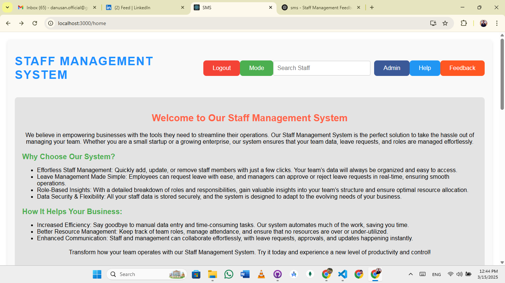
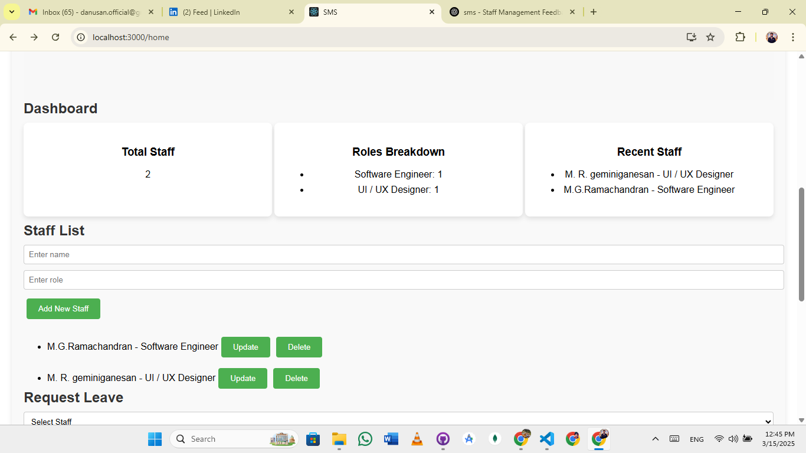
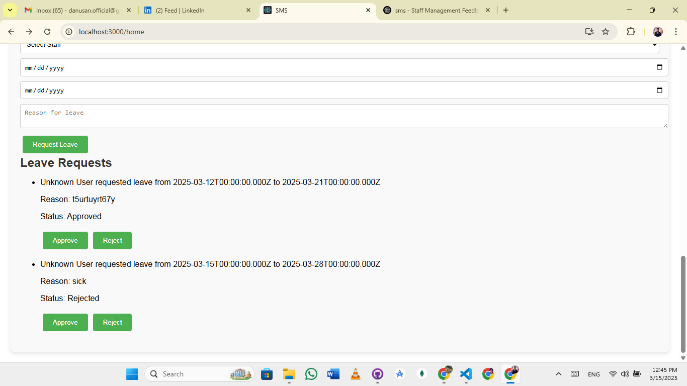
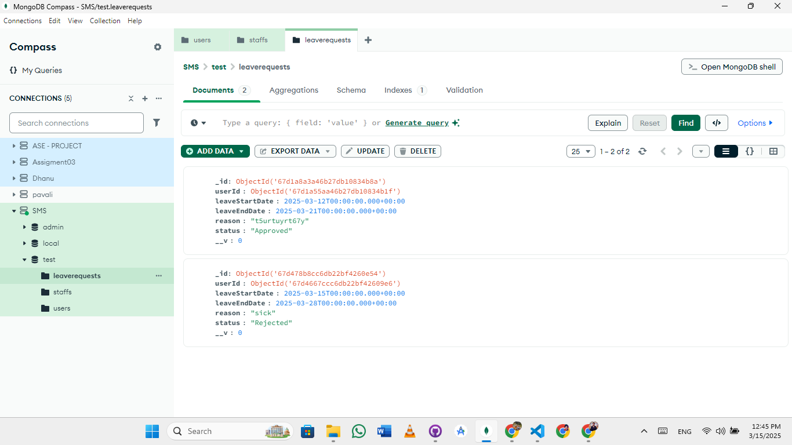

# Staff Management System

A web-based **Staff Management System** built with **React.js** and connected to **MongoDB** for efficient management of staff data, leave requests, and roles. This system allows for easy management of staff profiles, CRUD operations, leave requests, and more. The system also supports **dark mode**, **admin login**, and **staff registration**.

## Features

- **Admin Login & Staff Login**: Separate logins for Admin and Staff.
- **Staff Management**: Admin can add, update, and delete staff members.
- **Leave Requests**: Staff can apply for leave, and Admin can approve or reject it.
- **CRUD Operations**: Full functionality for adding, editing, and removing staff members.
- **Search Functionality**: Easy staff search by name.
- **MongoDB Integration**: All records are stored in MongoDB for persistence.
- **Dark/Light Mode**: Toggle between dark and light modes for user preference.
- **Help & Feedback**: Staff can send feedback and access help information.

## Prerequisites

Before running this project, ensure you have the following installed:

- **Node.js** (Version 12 or higher)
- **MongoDB** (Local or Cloud-based)

### Steps to Run the Project:  
1. Clone the repository:  
   ```bash
   git clone https://github.com/dondanu/Staf-management-System.git

2. Navigate to the project directory:
   ```bash
   cd Staf-management-System

3. Install dependencies for both frontend and backend:
   ```bash
   npm install

4. Start the backend server:
   ```bash
   node server.js

5. Start the frontend:
   ```bash
   npm start

Access the application at http://localhost:3000.

 # Screenshots
##Login Page
Displays options to navigate to the Teacher or Student View.


##Dashboard View
Secure login for teachers to access and manage class details.


##Dashboard View 2
Comprehensive interface for managing classes and uploading notes.


##Leave Request Management
Simplified dashboard for students to access class details and download notes.


##Mongo DB
Simplified dashboard for students to access class details and download notes.



## Technologies Used

 - **Frontend:** React.js, React Router
 - **Backend:** Node.js (optional for API endpoints)
 - **Database:** MongoDB (NoSQL database for staff and leave records)
 - **Styling:** Inline CSS, CSS modules for styling
 - **Authentication:** JWT (JSON Web Tokens) for Admin and Staff login
 - **Deployment:** Heroku (optional, for deployment)
